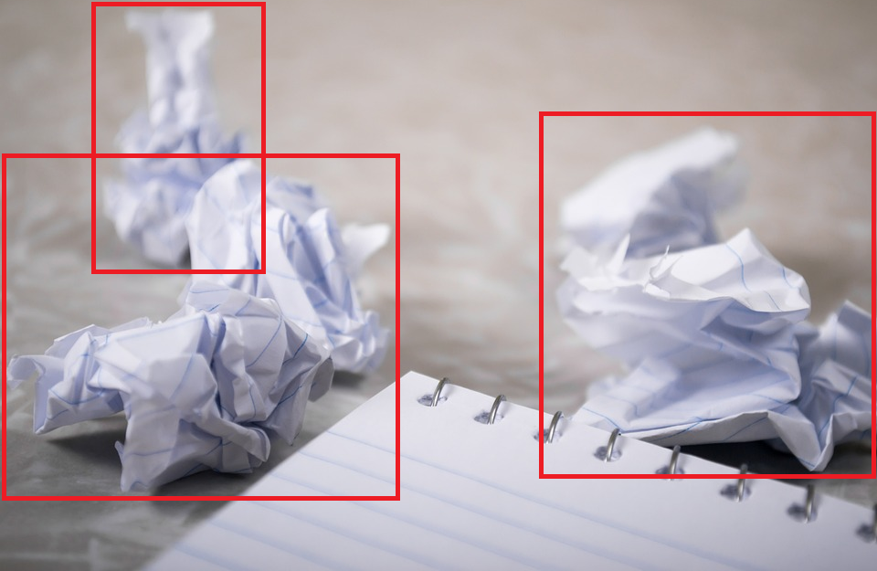

## **재활용 품목 분류를 위한 Object Detection (Naver Boostcamp AI Tech CV-02조 팀 멋쟁이)**

### 📌 **대회 정보**
- - -
- **대회 주제** : 주어진 사진에서 쓰레기를 Detection하는 모델 구현
- **대회 목표** ~~(한 명당 하나씩 작성해주세요)~~
    - 체계적인 실험 관리 (e.g. 비교분석을 위한 table 작성)
    - something
    - something
    - something
    - something
- **대회 일정** : 23.05.03 ~ 23.05.18 19:00 (2주)

### 🐦 **Members**
- - -
|**이름**|**역할**|**github**|
|:-:|:-:|:-:|
|김성한|차차|[Happy-ryan](https://github.com/Happy-ryan)|
|박수영|정|[nstalways](https://github.com/nstalways)|
|정호찬|합|[Eumgil98](https://github.com/Eumgill98)|
|이채원|시|[Chaewon829](https://github.com/Chaewon829)|
|이다현|다|[DaHyeonnn](https://github.com/DaHyeonnn)|

### 📝 **Dataset 개요**
- - -
- **전체 데이터셋 통계**
    - 전체 이미지 개수 : 9754 장 **(train 4883, validation 4871)**
    - 클래스 종류 : 10 개 (General trash, Paper, Paper pack, Metal, Glass, Plastic, Styrofoam, Plastic bag, Battery, Clothing)
    - 이미지 크기 : (1024, 1024)

- **이미지 예시** 
 
**위 이미지는 예시일 뿐이며, 실제 데이터와는 관련이 없습니다.**

- **(주의) Submission & Annotation format**
    - Submission format은 PASCAL VOC 형태!
    - Annotation format은 COCO 형태!
    - **format마다 bbox를 정의하는 방식이 다르므로**, metric 계산 시 주의!! [(Ref)](https://towardsdatascience.com/coco-data-format-for-object-detection-a4c5eaf518c5)
